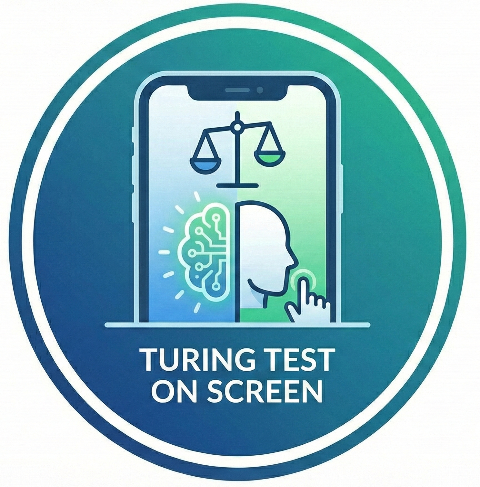

# Agent Humanization Benchmark (AHB)

<div align="center"></div>
**Turing Test on Screen: A Benchmark for Mobile GUI Agent Humanization**

This repository provides tools for collecting, analyzing, and improving mobile GUI agent behavior to make it more human-like. The benchmark evaluates agents based on their ability to mimic human touch dynamics and physical sensor events to avoid detection by digital platforms.

## Quick Start Guide

### I just want to...

- **Collect human data** → See [data_collection/README.md](data_collection/README.md#collecting-human-data-with-some-automation)
- **Collect agent data** → See [data_collection/README.md](data_collection/README.md#collecting-agent-data)
- **Use fake-adb for my agent** → See [agent_tools/fake_adb/README.md](agent_tools/fake_adb/README.md)
- **Analyze collected data** → See [analysis/README.md](analysis/README.md)
- **Set up a custom agent for automated data collection** → See [data_collection/README.md](data_collection/README.md#custom-agents)

## Project Structure

```
.
├── agent_tools/fake_adb/          # ADB wrapper for human-like agent behavior
│   ├── README.md                  # Setup and usage guide
│   ├── adb_wrapper.py             # Main wrapper implementation
│   └── adb_wrapper_config.json    # Configuration file; you may need to modify for your device
│
├── data_collection/               # Tools for collecting interaction data
│   ├── README.md                  # Data collection guide
│   ├── main.py                    # Human data collection entry point
│   ├── automations.py             # Agent automation orchestration
│   ├── controller.py              # Recording controllers
│   ├── automations_agents.json    # Agent configuration
│   ├── automations_general_android.py  # Generic Android actions
│   ├── automations_specific_phone.py   # Phone-specific actions; you may need to modify for your device
│   ├── app_name_translations.json # App name to launcher mapping; please load from metadata files
│   └── agents/                    # Agent-specific configurations
│       ├── README.md              # Agent setup guide
│       └── ui-tars/               # UI-TARS patches and setup
│
├── analysis/                      # Data processing and analysis utilities
│   ├── README.md                  # Analysis guide
│   ├── lib/                       # Core libraries
│   │   ├── motionevent_classes.py
│   │   ├── gesture_log_reader_utils.py
│   │   ├── sensor_log_reader_utils.py
│   │   └── feature_library.py
│   ├── processing/                # Feature extraction and processing
│   ├── plotting/                  # Visualization tools
│   └── swipe_data.pkl             # Pre-processed human swipe data; please load from metadata files
│
├── analysis_playground.ipynb      # Main analysis Jupyter notebook
├── requirements.txt               # Python dependencies
├── Formated_Data_Renamed.xlsx     # Metadata of collected data; please load from metadata files
└── tasks.csv                      # Task definitions for data collection; please load from metadata files
```

## Critical Setup Steps

### 1. Metadata Files

Some functionality requires metadata files that are **NOT** in this online repository. You must copy them:

```bash
# clone tree/main/metadata from huggingface dataset
cd ..
git clone --depth 1 --branch main https://huggingface.co/datasets/lyyang2766/Passing-the-Turing-Test-on-Screen-Agent-Humanization-Benchmark --filter=blob:none --sparse
cd turing_test_on_screen
git sparse-checkout set metadata
cd -
cp -r ../metadata/* ./
```

This maintains the folder structure (e.g., `metadata/analysis/processing/swipe_data.pkl` → `./analysis/processing/swipe_data.pkl`).

**Files that will be copied**:
- `analysis/processing/swipe_data.pkl` - Human swipe data for humanization
- `data_collection/app_name_translations.json` - App name mappings
- `tasks.csv` - Task definitions for experiments
- `Formated_Data_Renamed.xlsx` - Metadata of collected data (e.g., device info, task info)

### 2. Prerequisites

- **ADB** installed and configured with USB debugging enabled on Android device
- **Python** 3.8+ with dependencies: `pip install -r requirements.txt`
- **Android device** with screen unlocked (no pin/pattern during collection)
- **ADBKeyboard** installed on device (for IME event capturing): https://github.com/senzhk/ADBKeyBoard
- **Motion Logger App** installed (for sensor recording): At `data_collection/MyMotionLogger/`

### 3. Screen Recording Modification (Required for 3+ min recordings)

The default Android `screenrecord` has a 180-second limit. To extend beyond 3 minutes, please view the instructions in [data_collection/README.md](data_collection/README.md#2-configure-screen-recording) to modify the AOSP source and build a custom `screenrecord` binary.

## Supported Agents

| Agent | Humanization | Status |
|-------|-------------|--------|
| UI-TARS | ✅ Full support with patches | Working |
| MobileAgent-E | ✅ Fake ADB wrapper | Working |
| CPM-GUI-Agent | ✅ Fake ADB wrapper | Working |
| OpenAutoGLM | ✅ Fake ADB wrapper | Working |

Since we borrow official demos for testing, please see [data_collection/agents/README.md](data_collection/agents/README.md) for setup instructions.

## Quick Examples

### Collect Human Data

```bash
python data_collection/main.py \
    --user your_username \
    --task_provide_file tasks.csv \
    --automatically_prepare_provided_task_app \
    --automatic_switch_app \
    --automatic_exit_app_and_reset
```

### Collect Agent Data

```bash
# Run automated experiments
python data_collection/automations.py
```
For running other agents not listed in the [supported agents table](#supported-agents), please see [data_collection/README.md](data_collection/README.md#experiment-with-agents-not-listed-in-automations_agentsjson) for instructions on how to set up and run with the fake ADB wrapper.

### Analyze Data

You need to download data that you want to analyze from the Huggingface dataset, unzip and place anywhere within the `logs/` folder. Then,

Open the Jupyter notebook:
```bash
jupyter notebook analysis_playground.ipynb
```

Or use command-line tools(not recommended):
```bash
python analysis/processing/extract_feature_of_swipes.py \
    --input-glob "logs/gesture_recording_*.log" \
    --output features.csv
```

## Key Concepts

### Humanization Strategies

1. **Motion Transformation**: Apply mathematical transformations (B-splines, rotation) to raw agent paths
2. **Temporal Adjustment**: Match human distributions for tap durations and action intervals
3. **Fake Actions**: Inject non-functional gestures to mask mechanical execution patterns

### Data Collection

Captures four types of data:
- **Motion Events**: Raw touch input from `/dev/input/eventX`
- **Sensor Events**: Accelerometer, gyroscope, magnetometer from motion logger app
- **Screen Recordings**: Video of device screen during interaction
- **IME Events**: Keyboard input events for text analysis

### Analysis Pipeline

1. Parse raw logs into structured events
2. Extract kinematic and temporal features
3. Train classifiers (SVM, XGBoost) to distinguish human vs. agent
4. Evaluate humanization strategies via AUC reduction

## Documentation

- **[agent_tools/fake_adb/README.md](agent_tools/fake_adb/README.md)** - Fake ADB wrapper setup and API
- **[data_collection/README.md](data_collection/README.md)** - Data collection workflow and configuration
- **[analysis/README.md](analysis/README.md)** - Data analysis and feature extraction
- **[data_collection/agents/README.md](data_collection/agents/README.md)** - Agent setup and integration

## Citation

If you use this benchmark in your research, please cite:

```
@article{turing_test_on_screen,
    title={Turing Test on Screen: A Benchmark for Mobile GUI Agent Humanization},
    author={...},
    journal={...},
    year={2026}
}
```

## License

Part of the Agent Humanization Benchmark (AHB) research project.
